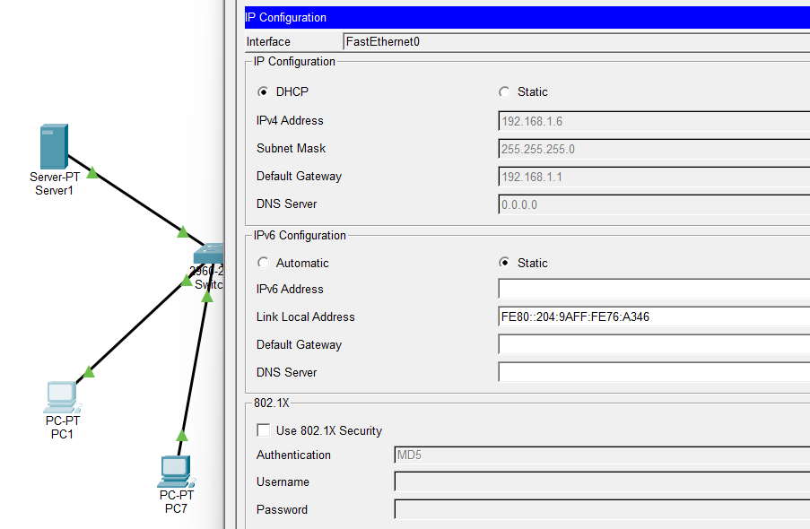
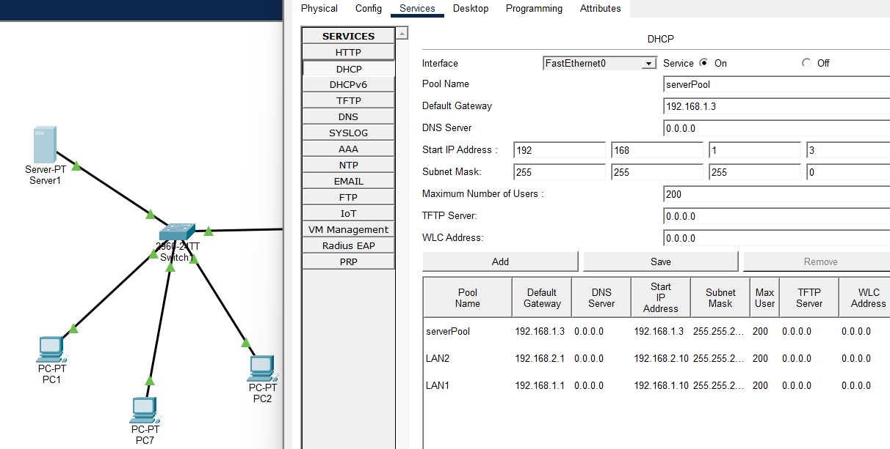
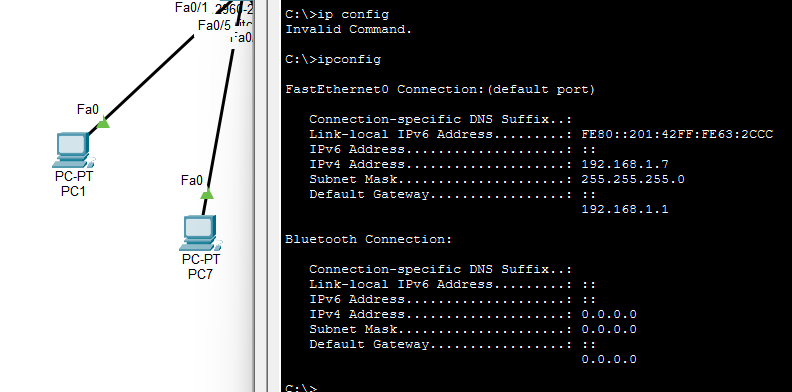
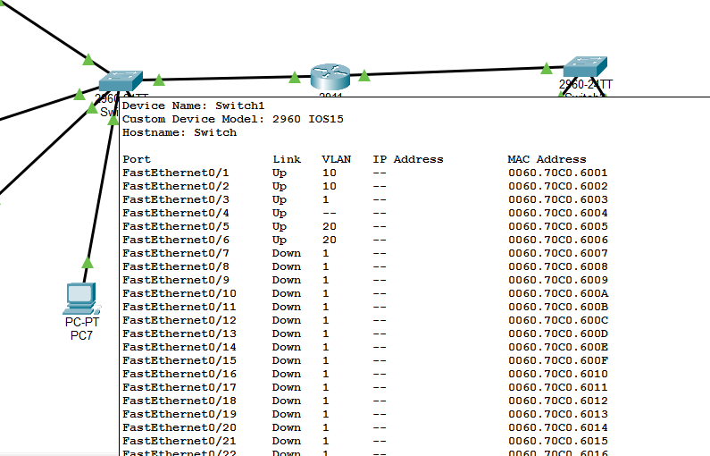
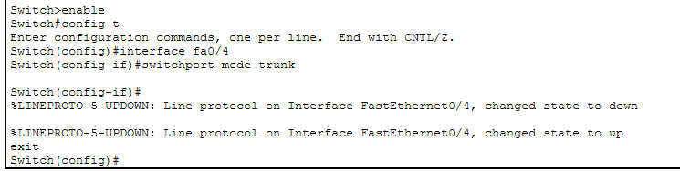
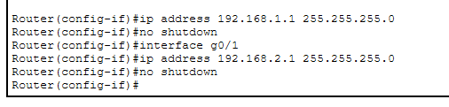
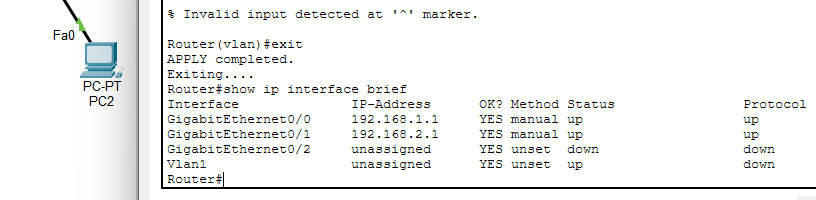
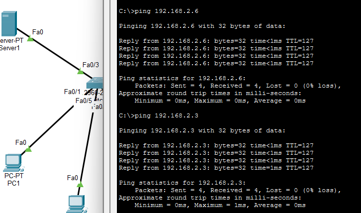
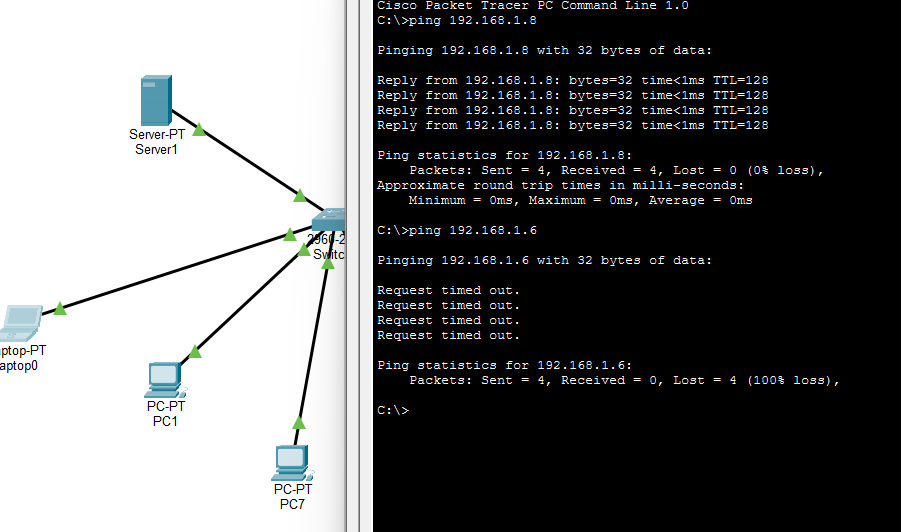

# Packet Tracer Network Lab

Network configuration lab built in Cisco Packet Tracer as part of a cybersecurity course exam. Covers DHCP, VLAN segmentation and inter-VLAN routing - the kind of fundamental networking knowledge that sits underneath everything in security.

**Tools used:** Cisco Packet Tracer  
**Context:** Cybersecurity course exam task

---

## What I built

A small network with two VLANs connected through a router, where devices get their IP addresses automatically via DHCP. The goal was to configure the network so that devices within the same VLAN can communicate with each other, but can only reach devices in the other VLAN through the router.

---

## How devices get their IP addresses - DHCP

Instead of manually assigning IP addresses to every device, the network uses DHCP (Dynamic Host Configuration Protocol) to hand them out automatically. Here's what happens step by step:

1. A PC boots up and sends out a **DHCP Discover** broadcast - basically shouting "is there a DHCP server here?"
2. The DHCP server (in this case the router) hears it and offers a free IP address from its pool
3. Along with the IP address, it also sends the subnet mask, default gateway, and DNS server address
4. The PC accepts the offer and starts using that IP

The router's interface address is used as the default gateway, so once devices have their IPs they can reach other networks through it.

---

## How VLAN segmentation works

VLANs (Virtual Local Area Networks) let you split one physical network into separate logical networks. I created two:

- **VLAN 10** — IT department
- **VLAN 20** — ECO department

Switch ports were configured in access mode and assigned to their respective VLAN. Even though devices in VLAN 10 and VLAN 20 are connected to the same physical switch, they cannot communicate directly with each other - the VLAN boundary blocks that traffic.

This is useful from a security perspective - it means a compromise in one department doesn't automatically give access to the other.

---

## How the router enables inter-VLAN routing

VLANs isolate traffic, but sometimes devices in different VLANs do need to communicate - just in a controlled way through the router. This is called inter-VLAN routing. The router has a separate interface for each VLAN, each with its own IP address. That IP becomes the default gateway for devices in that VLAN. 

When a device in VLAN 10 wants to reach a device in VLAN 20:
1. It sends the packet to its default gateway - the router's VLAN 10 interface
2. The router checks its routing table and forwards the packet through the VLAN 20 interface
3. The packet arrives at the destination in VLAN 20

Without this setup, the VLANs would be completely isolated. With it, communication is possible but controlled - everything passes through the router, which means it can also be filtered or monitored.

---

## Testing connectivity

After configuration I tested communication between devices to confirm everything was working correctly.

**Same VLAN - ping succeeds:**

**VLAN isolation test - one succeeds, one times out:**

This second test confirms the VLAN boundary is working - the first ping succeeds because it goes through the router, while the second times out because that segment is isolated as expected.

---

## What I have learned

Networking concepts like DHCP, VLANs, and routing are easy to read about but actually configuring them makes them click in a different way. The key insight from this lab is that VLANs give you segmentation for free - you don't need separate physical hardware to isolate departments, but you need a router to let them talk when necessary and that router becomes a natural place to apply security policy.

---

**Tools:** Cisco Packet Tracer  
**Context:** Cybersecurity course exam task
